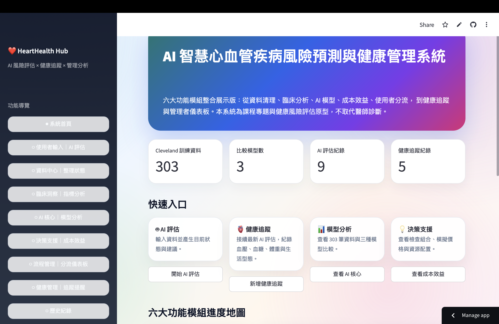
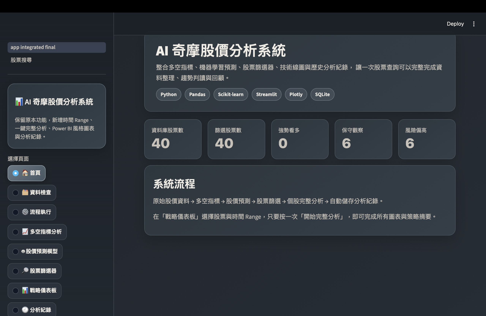
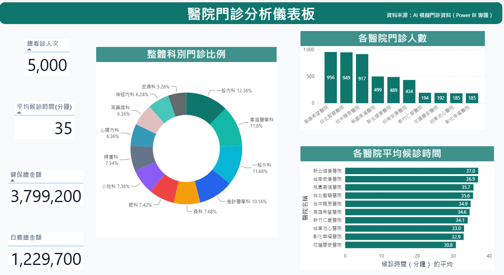

# 🌊 墨海研究室

### 用資料探索問題，用 AI 打造解決方案。

**AI ・ Data Analytics ・ Business Intelligence ・ Dashboard**

---

## 👋 關於

你好，我是 **章魚** 🐙

歡迎來到 **墨海研究室**。

這裡分享我透過 **AI、資料分析、Python、SQL、Power BI** 完成的作品。

我希望展示的不只是技術本身，而是如何把資料、模型與視覺化整合成可以理解、可以操作、可以協助決策的解決方案。

---

## 🛠 技術工具

---

# 🚀 精選作品

---

## ❤️ AI 心血管疾病預測與健康管理系統

  

> 結合機器學習、模型分析與互動式 Dashboard 的 AI 健康管理平台。

### ✨ 專案亮點

- ❤️ AI 心血管疾病風險預測
- 📊 多模型比較與分析
- 🧠 模型解釋
- 📈 互動式 Dashboard
- 🩺 健康紀錄追蹤
- 💡 決策支援資訊
- 🌐 Streamlit Web App

### 📈 專案成果

| 指標 | 結果 |
|---|---:|
| Accuracy | **90.16%** |
| ROC-AUC | **95.51%** |
| 最佳模型 | Random Forest |
| Dataset | Cleveland Heart Disease（303 筆） |

### 🛠 技術

`Python` `Pandas` `Scikit-learn` `Streamlit` `SQLite` `Plotly`

### 🔗 作品連結

> 此作品展示從資料處理、模型建立、模型分析、視覺化到 Web 部署的完整 AI 應用流程。

---

## 📈 AI 台股預測分析系統

  

> 整合股票資料、技術指標、法人資訊與機器學習的互動式分析平台。

### ✨ 專案亮點

- 🔍 股票搜尋
- 🤖 AI 漲跌預測
- 📊 KD / RSI / MACD 等技術指標
- 💰 法人籌碼分析
- 📉 技術線圖
- 🗂 歷史分析紀錄
- 🚀 一鍵完整分析
- 🌐 Streamlit Dashboard

### 🛠 技術

`Python` `Pandas` `Streamlit` `SQLite` `Plotly` `Machine Learning`

### 🔗 作品連結

> 此作品展示資料整合、資料庫運用、技術分析與 AI 預測整合能力。

---

## 📊 Healthcare Outpatient Analytics Dashboard

  

> 以 Power BI 建立的醫療門診互動式商業智慧儀表板，協助快速理解醫療資源與門診資訊。

### ✨ Dashboard 亮點

- 🏥 醫療資源總覽
- 📊 KPI Dashboard
- 🏢 醫院比較
- 👨‍⚕️ 醫師分布與門診分析
- 👥 病患分析
- 📈 趨勢分析
- 💡 商業洞察
- 🔎 互動式資料探索

### 🛠 技術

`Power BI` `DAX` `Power Query` `Excel`

### 🔗 作品連結

> 此作品展示資料視覺化、商業分析與決策型 Dashboard 設計能力。

---

# 🧩 技術能力

### 💻 Programming
`Python` `SQL`

### 📊 Data Analytics
`Pandas` `NumPy` `Scikit-learn`

### 📈 Business Intelligence
`Power BI` `DAX` `Power Query`

### 🎨 Visualization
`Plotly` `Matplotlib`

### 🗄 Database
`SQLite`

### 🤖 AI / Machine Learning
`Classification` `Model Evaluation` `Explainability`

### 🌐 Deployment
`Streamlit` `GitHub`

---

# 🎯 目前持續學習

- AI 應用
- 資料分析
- Business Intelligence
- Dashboard Design
- Python Automation
- 資料處理流程
- AI 輔助工作流程

---

# 🧭 作品展示原則

**墨海研究室以作品成果與解決方案展示為主。**

公開內容包含：

- 專案說明
- 系統畫面
- 分析成果
- 技術架構
- Live Demo
- 使用情境

核心原始碼、模型檔、資料庫與資料集不作為公開展示內容。

---

# 🌊 墨海研究室

### 每一筆資料，都值得被看見。

**展示的是解決方案，而不只是程式碼。**

